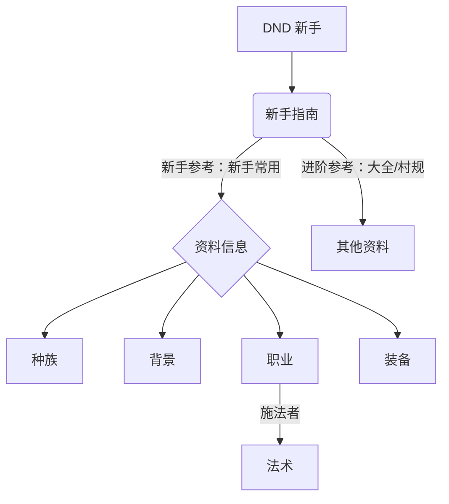
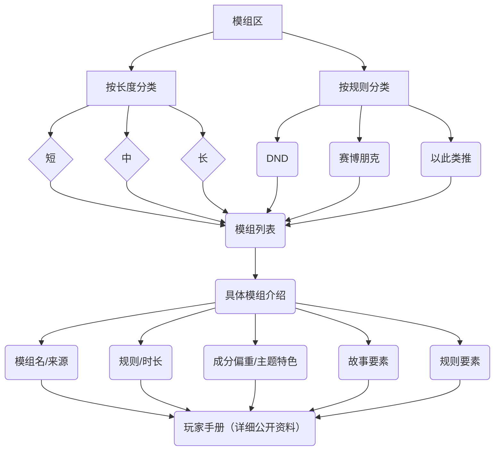

::: center

## 快速跳转

[网站基本格式](#网站基本格式)

[规则区](#规则区)

[模组区](#模组区)

[跑团记录区](#跑团记录区)

:::

---

::: center

## 网站基本格式

:::

本网站格式使用 `Markdown` 框架进行编辑。

- 英文/数字/标点符号、关键专有名词强调 会与主体中文文本相隔一个空格以突出显示
- `代码`元素会起到强调作用
- 重要名词/快速参考 会以 缩写释义 的形式呈现，词语将会选取自身口头最常用的形式以对应带团参考需求
- <Badge type="danger" text="投骰方式" /> 会以红色徽章的形式标出，如，近战攻击检定 = <Badge type="danger" text="D20 + 熟练加值 + 力量调整值" />
- <Badge type="warning" text="计算方式等其他关键信息" /> 会以橙色徽章的形式标出，如，AC = <Badge type="warning" text="10 + 敏捷调整值 + 护甲加值" />

*[缩写释义]: 就像这样
*[AC]: Armor Class,防护等级
*[近战攻击检定]: Melee Attack Roll

::: info 修改历史

1. 专有名词^Term^上标规则强调由于严重影响观感，已经去除

2. ==标记格式==强调由于严重影响观感，已经去除；主题所带有的马克笔功能似乎方便使用，会根据情况使用

3. 从复古电子风格改为更为便于阅读的小圆-晓美焰配色方案

:::

---

## 规则区

`规则区`由以下区域组成：

```
- 新手指南
   - 车卡指南
   - 常用骰法
   - ...
- 资料信息
   - 种族
   - 背景
   - ...
- 其他资料
   - 参考链接
   - 神官村规
   - ...
```

大致逻辑为：

1.`新手指南`：新手仅需要遵循`新手指南`的引导便可`完成车卡、游玩`的过程，其间需要跳转到`资料信息`查阅；

2.`资料信息`：提供经过`简化后`、尽可能详尽的信息`以供查阅`；

3.`其他资料`：进阶详尽的、更多非官方原版规则的信息则在此处罗列。

---

例：

- `DND` 玩家需要跟随`新手指南`的顺序设计人物
  - 从`资料信息`处参考`职业`数据
  - 长团升级超越新手水平后，从`其他资料`的`参考链接`处参考`未录入资料`。



---

## 模组区

`模组区`首先根据`短`/`中`/`长`团进行分类，其次根据`规则`进行分类；

也提供了根据`主持`进行分类的办法以匹配风格。

::: note 时长

`短`/`中`/`长`分别指`1 次跑完`、`3-5 次左右跑完`、`5 次以上跑完`，每次以 `6-8 小时`为准。

其中，`短`团根据`跑团热线`的`不同收费标准、按照理想时长`进行标记细分。

标注为`“通用”`/`“规则名”`的模组可以在对应`规则`里使用。

:::

`模组`会标注其`各式特点`以供挑选，与`规则`相关的特点会在`模组区指南页`进行描述，如`DND`中的`T1/2/3/4`。

::: info Tier

`DND` 中，每 `5` 级构成 `1` 个 Tier，对应 `T1/2/3/4`

注：按照官方的严格分法，应该是`1-4`、`5-10`、`11-16`、`17-20`

:::

`模组`总览通常会含有以下部分：

- 模组`名`、来源
- 模组`规则、时长`
- 模组`成分偏重`与`主题特色`
- 模组`故事要素`（扮演、内容相关的，如 Neta、风格、主要元素、特点等）
- 模组`规则要素`（规则、游玩相关的，如特殊机制、敌人预期等）



---

## 跑团记录区

`跑团记录区`以`博客`的形式记录，形式相对自由。

通常会包括`线上角色卡`记录、`故事简记`。

玩家可`主动申请记录`，欢迎来稿。
